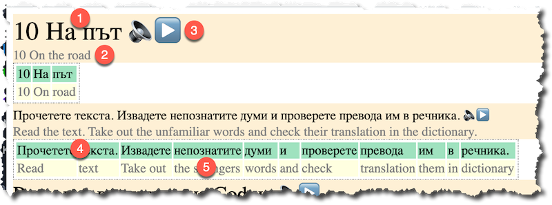

# Texts for Learning a Language with the Birkenbihl Method
Foreign language texts are presented in several different forms:

1. The original text paragraph by paragraph (currently all texts here are in Bulgarian)
2. Translated text paragraph by paragraph (currently all translations are in English)
3. Transcribed original text paragraph by paragraph into spoken language (click the *play* button to start▶️/stop⏹ the audio)
4. The original text word by word
5. Translated text word by word: Below each original word its translation is placed. This is one of the main aspects of the Birkenbihl method.

Read more about the Birkenbihl method for learning languages:

- [Birkenbihl method – the fastest way to learn foreign languages](http://www.vidactic.com/?page_id=868)
- [The Birkenbihl1䋩 Language Learning Method and Its Practical Application for Learning English and German at IBU - PDF](https://www.shitennoji.ac.jp/ibu/docs/toshokan/kiyou/41/kiyo2005w-18johann.pdf)
- [The Birkenbihl-Approach to Language Learning - PDF](https://www.ludwiglingg.ch/MethodEnglish.pdf)

## Texts

- [Джудженцето Алфи - A first experiment](Джудженцето Алфи) taken from the book [ПРИКАЗКИ ЗА ДЯДО КОЛЕДА from fiut.bg](https://www.fiut.bg/prikazki-za-djado-koleda-zabavni-igri.html)
- [Bulgarian for Refugees (A1) - Lesson 10 (excerpt)](Bulgarian for Refugees - Lesson 10), full PDF book can be found [here](https://caritas.bg/cms/wp-content/uploads/2015/04/A1-English.pdf?x10535).
- [Descent into the Maelstrom - Edgar Allan Poe (excerpt)](Descent into the Maelstrom - Edgar Allen Poe), full Bulgarian text can be found [here](https://chitanka.info/book/37-spuskane-v-maelstrxom).

